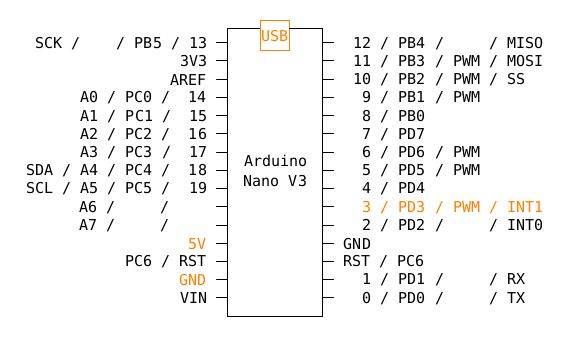

# arduino / arduino-nano-v3 / ds18b20

- [requirements](https://github.com/devel0/iot-examples#development)

## wirings

- ds18b20
    - power 3-5.5v
    - data line
        - to PD3 ( or PD2 )
        - pull-up with 4.7 kΩ to VCC

## notes

- multiple thermometer can be connected using single data wire
- each device has its own hardware address ( printed when program starts )
