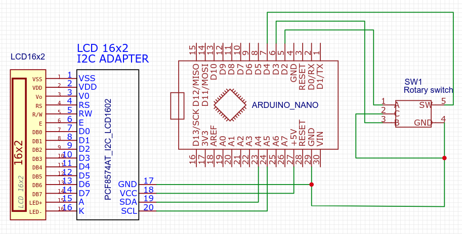

# arduino / arduino-nano-v3 / rotary-encoder

<!-- TOC -->
- [arduino / arduino-nano-v3 / rotary-encoder](#arduino--arduino-nano-v3--rotary-encoder)
  * [config i2c address](#config-i2c-address)
  * [stm32 notes](#stm32-notes)
  * [libraries](#libraries)
<!-- TOCEND -->

use of lcd 16x2 through i2c adapter and rotary encoder to retrieve current position and hit btn

:warning: upload sketch before to connect to avoid ports burn ( if previous sketch may used D2,D3,D4 as output )



- rotary clockwise

</img>

- rotary counter clockwise

</img>

- [requirements](https://github.com/devel0/iot-examples/blob/0954ccd90758022a0d376a13e122c7f90a0a5e5d/README.md#L48)

## config i2c address

- if unsure about your lcd i2c adapter address uncomment [I2C_DEVICE_SCAN](https://github.com/devel0/iot-examples/blob/f759cba72e2c8006ac51bb9e12f64af73c2bbde8/arduino/arduino-nano-v3/rotary-encoder/config.h#L23) macro in the config and hit a run to see on the serial terminal which address detected then set it to [LCD_ADDR](https://github.com/devel0/iot-examples/blob/f759cba72e2c8006ac51bb9e12f64af73c2bbde8/arduino/arduino-nano-v3/rotary-encoder/config.h#L24)

output example:

```
Scanning...                                                                                                           
I2C device found at address 0x3F  !                                                                                   
done
```

## stm32 notes

- the sketch can uploaded to stm32 core
- automatically detect [stm32duino](https://github.com/stm32duino/Arduino_Core_STM32) environment through the [ARDUINO_ARCH_STM32](https://github.com/devel0/iot-examples/blob/f759cba72e2c8006ac51bb9e12f64af73c2bbde8/arduino/arduino-nano-v3/rotary-encoder/config.h#L11) macro in order to use `digitalPinToInterrupt` and Wire.setSDA and Wire.setSCL to use custom bus between availables

## libraries

- included a DebouncedButton and DebouncedRotary to manage signal debouncing (default 50ms for button and 1500micros for rotary) ; these values used through millis() and macros() inside interrupt function that still valid even millis() value not changes during the interrupt itself