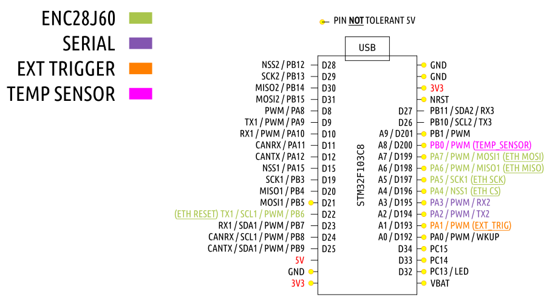

# platformio / bluepill-F103C8 / arduino / temp-sensors2

- [requirements](https://github.com/devel0/iot-examples#development-1)

example that show how to use enc28j60 to build a simple webapi server that allow to retrieve some db18b20 temperature sensors ; it also acts as a doorbel notifier using an external 3v3 trigger.

## library dep

after first build go to .pio/libdeps/genericSTM32F103C8 then make a symbolic link to UIPEthernet ( clone from git https://github.com/UIPEthernet/UIPEthernet ) to use latest version ; elsewhere registry reports 2.0.8 atm version versus 2.0.10