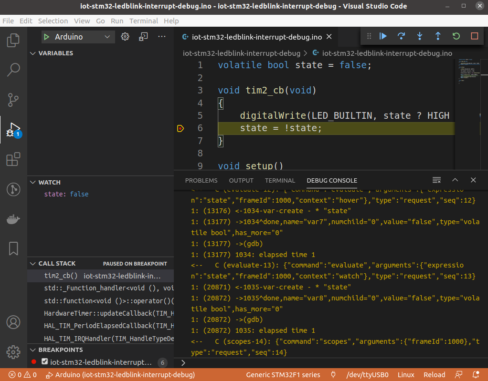

# stm32duino / bluepill-F103C8 / hwtimer

## description

- sample application led blink
- uses TIM2 counter 1Hz
- configured for vscode debugging
- [requirements](https://github.com/devel0/iot-examples#development-2)
