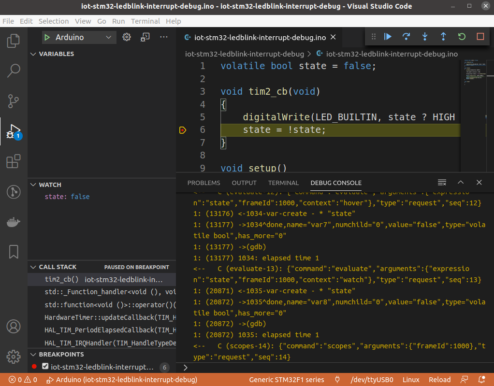

# iot-stm32-ledblink-interrupt-debug

## description

- sample application led blink
- uses TIM2 counter 1Hz
- configured for vscode debugging

## notes on vscode debugging

- prerequisites
    - https://github.com/stm32duino/Arduino_Core_STM32
    - https://www.st.com/en/development-tools/stm32cubeprog.html
    - https://github.com/xpack-dev-tools/arm-none-eabi-gcc-xpack/releases
- update `.vscode` json files paths accordingly to your tools path
- connect STLINK V2 ( 4 wires 3.3-swdio-swclk-gnd )