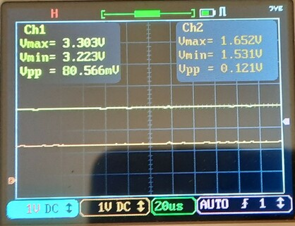

# stm32duino / nucleo-64-F446RE / dac

## description

generates real analog value 4095 (~100%) on pin PA4 and 2047 (50%) on pin PA5 using 12bit dac.

notes:
- 4096 as 100% isn't realiable and sometime generate 0 ; better to use 4095 for 100% out value

- [requirements](https://github.com/devel0/iot-examples#development-2)